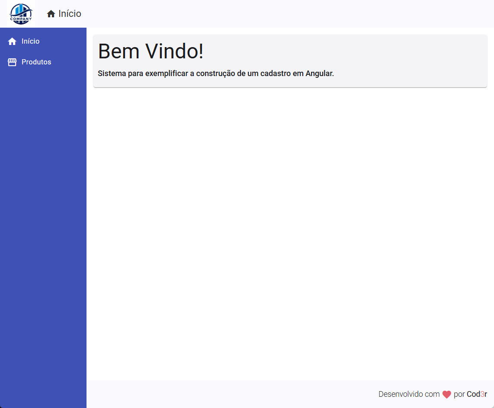

# Cadastro de Produtos (CRUD)

Curso online: 
Angular 9 - Essencial  
Cod3r

Autor: Leonardo Leitão

Desenvolvimento de um site para cadastro de produtos utilizando Angular no frontend e Node no backend. 

>Figura 1: Tela inicial

>Figura 2: Lista de produtos

>Figura 3: Cadastro de novo produto

>Figura 4: Atualização de produto

>Figura 5: Exclusão de produto

 

 
